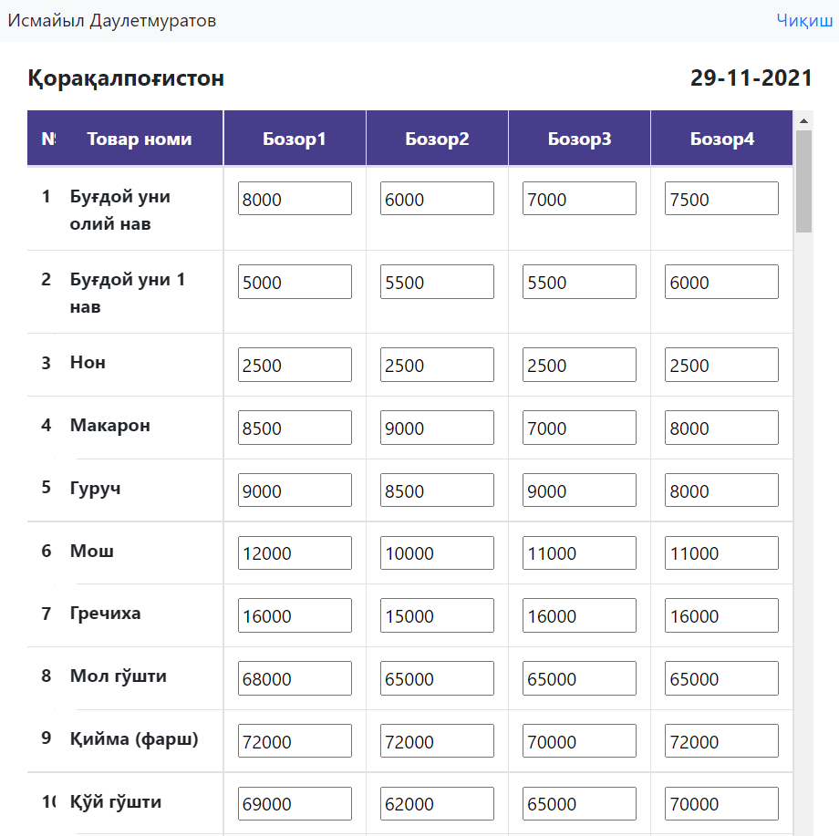
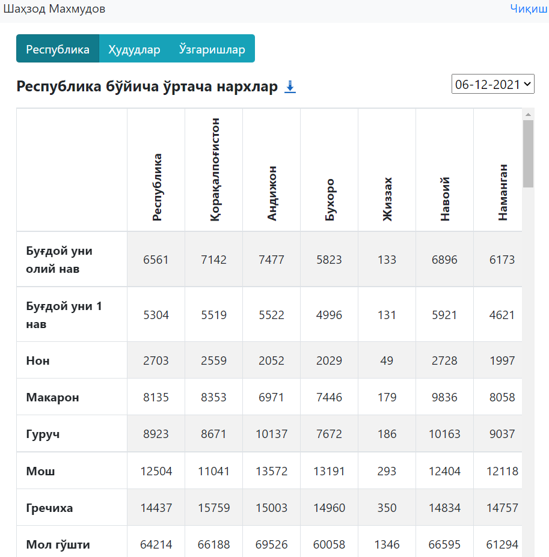
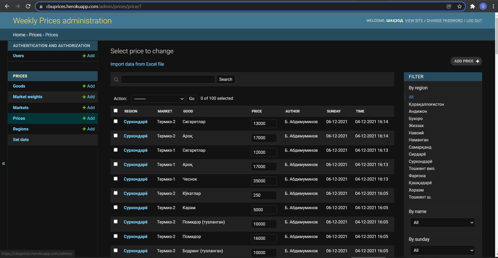

# Weekly-prices
Prices inputting online app for internal use in the bank.

CBU has 14 regional branches and every week they conduct price monitoring in markets. 
To automate the process of data collection I created this site which is easy-to-use for both data collectors (regions) and data-engineers (headquarter).

### Examples of the interface
#### Login page

#### Data inputting page for regions

#### Data checking page

#### Django admin page

